# secure-linux-server-lab
Ubuntu Server lab with Nginx, UFW firewall, SSH key authentication, log analysis, and tested webpage recovery.

My first guided Linux administration and security lab. I configured an Ubuntu Server VM, hosted a webpage with Nginx, secured SSH access, inspected logs, and tested webpage recovery.

## Environment

- VMware Workstation Pro
- Ubuntu Server 26.04.1 LTS
- 4 GB RAM, 2 CPU cores, 30 GB virtual disk
- NAT networking
- Windows PowerShell as the SSH client

## What I configured

- Updated Ubuntu packages.
- Installed Nginx and served a custom HTML webpage.
- Enabled UFW with incoming connections denied by default.
- Allowed port 22 for SSH and port 80 for HTTP.
- Configured an Ed25519 SSH key with a passphrase.
- Disabled SSH password authentication, keyboard-interactive authentication, and direct root login.

## Validation

| Test | Result |
| --- | --- |
| Access custom webpage from Windows | Page loaded successfully |
| Connect using SSH key | Login succeeded |
| Attempt password-only SSH login | Rejected with Permission denied (publickey) |
| Request /log-test | Nginx recorded a 404 response |
| Inspect SSH logs | Found Accepted publickey entry |
| Restore modified webpage from backup | Restored file and backup had matching SHA-256 hashes |

## Evidence

### First Ubuntu login
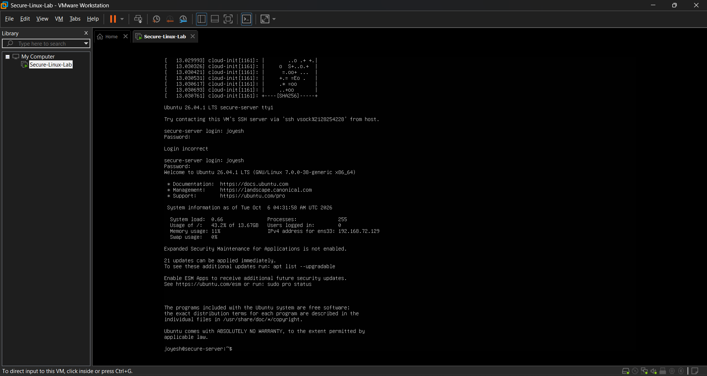

### Nginx browser test
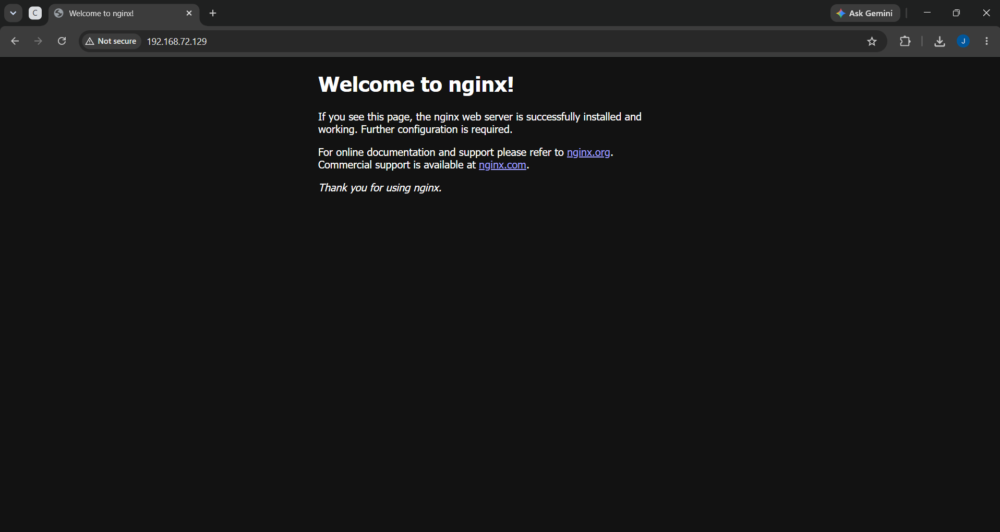

### Firewall configuration
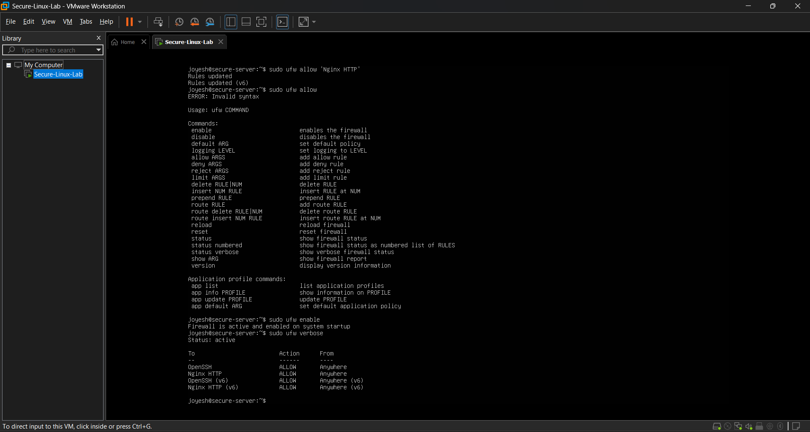

### SSH login
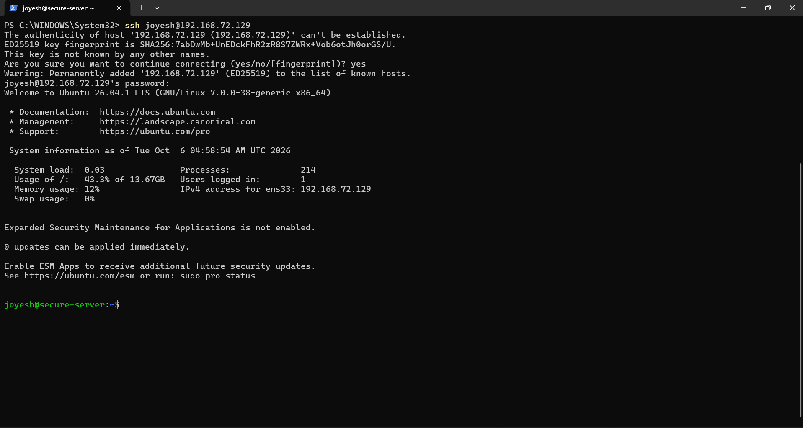

### SSH key authentication
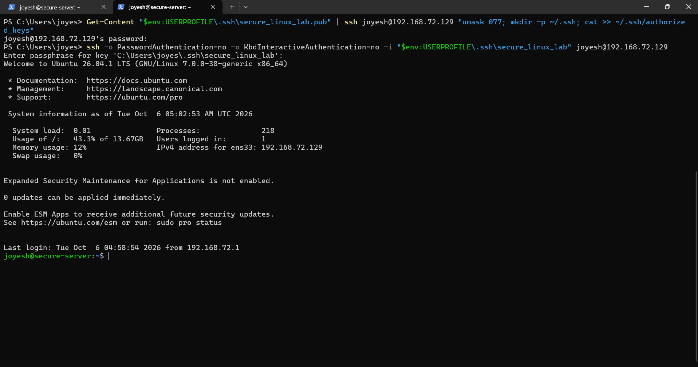

### Password-only SSH rejected
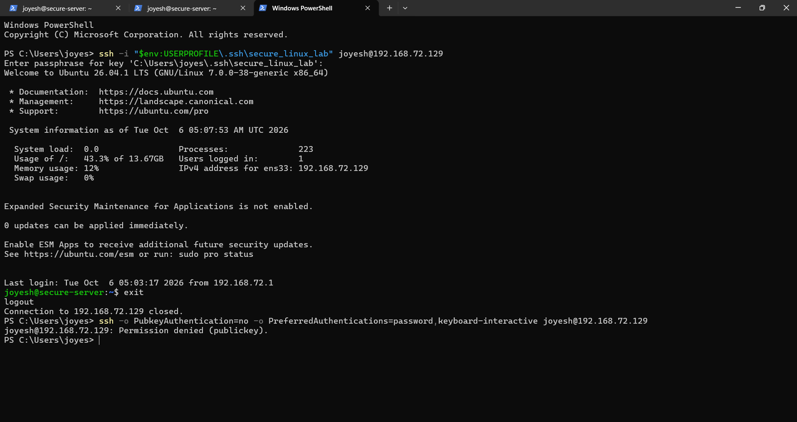

### Recovery snapshot
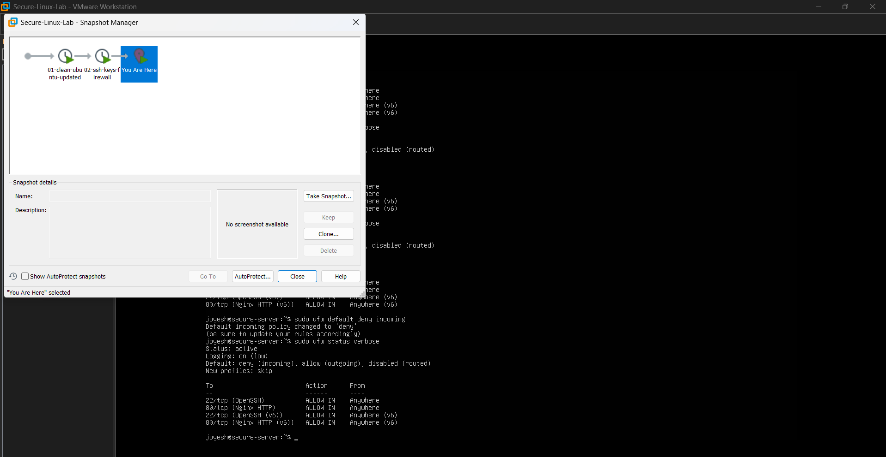

### Custom webpage
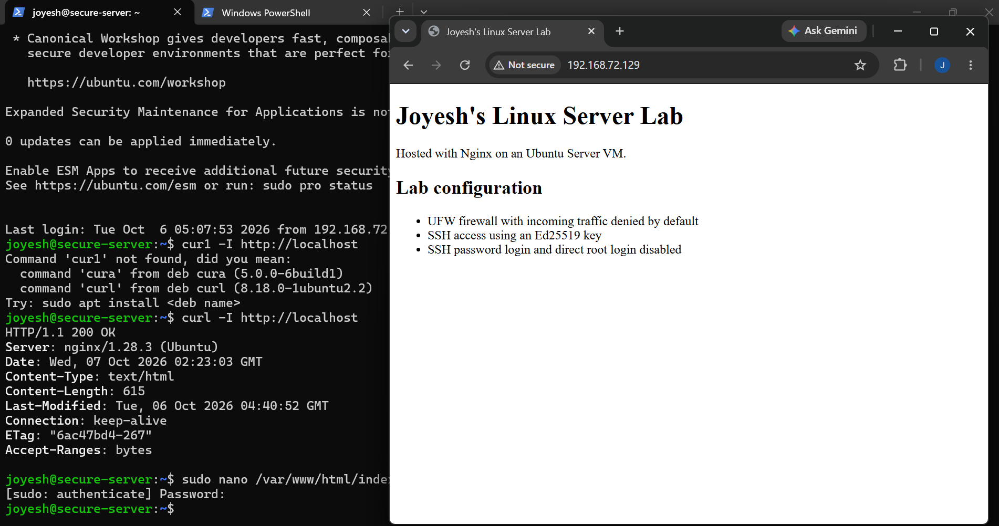

### Web request logs
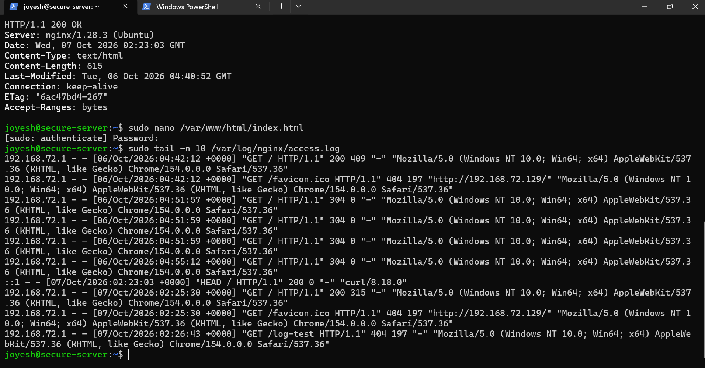

### SSH authentication logs
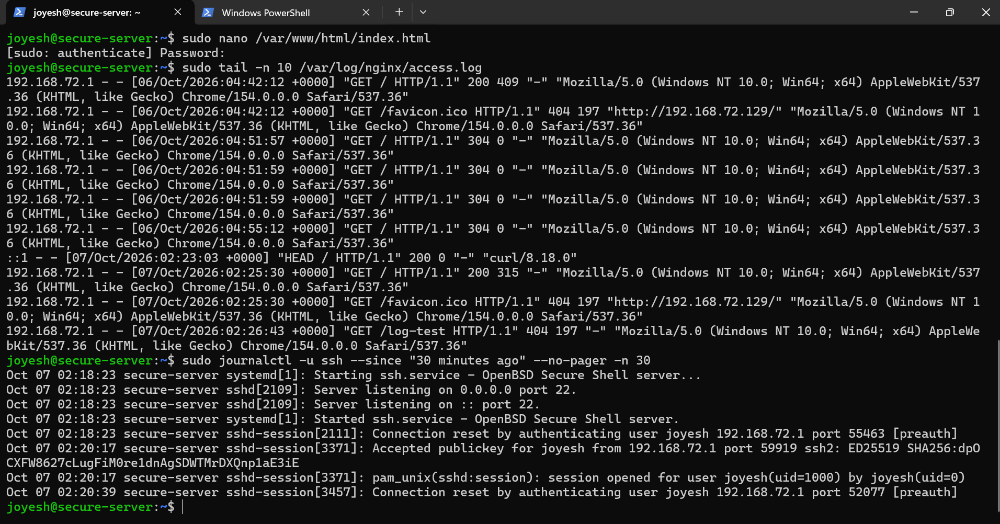

### Backup verification
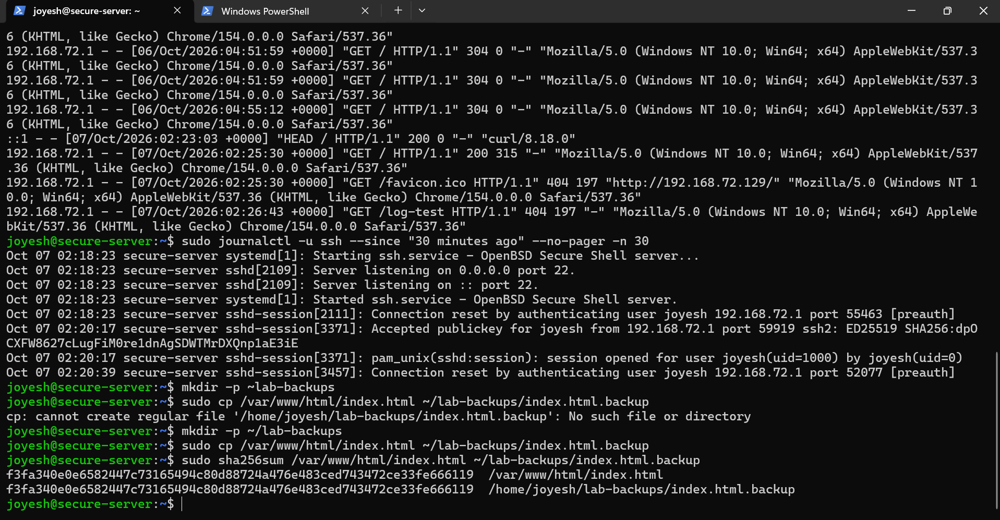

### Recovery verification
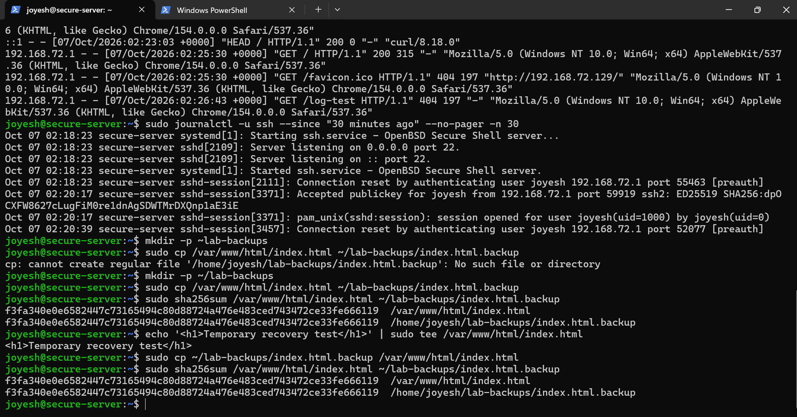

## Troubleshooting

- A resumed VM had unresponsive service commands and SSH connections. Restarting the VM restored responsiveness; the underlying cause was not confirmed.
- An SSH command used hyphens instead of underscores in the key filename. Correcting the path resolved the login failure.
- hostname -i returned a loopback address. I used ip -br addr to identify the VM's network address.
- A typo in the backup directory path caused a copy failure. Correcting the directory allowed the backup to complete.

## Learning and scope

I completed this lab with AI guidance and supplied commands. I am continuing to practice explaining the configuration and repeating the tasks independently.

This project demonstrates a local server lab. It does not include AWS deployment, HTTPS, centralized monitoring, or a full cybersecurity range.

The webpage backup is stored inside the same VM. It supports recovery from webpage changes but would not protect against losing the VM or its disk.

## Next steps

- Practice the setup independently.
- Store a backup outside the VM.
- Add HTTPS.
- Extend the lab to a cloud deployment.
